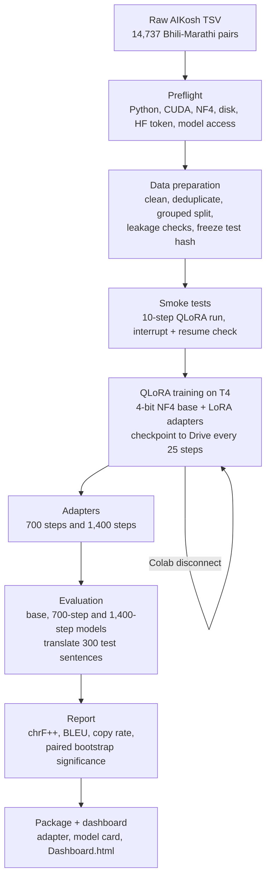

# Fine-Tuning Bodhan Indic-Translate for Dehwali Bhili → Marathi

Fine-tuning the Bodhan AI machine-translation model [`bodhan-ai/indic-translate`](https://huggingface.co/bodhan-ai/indic-translate) to translate **Dehwali Bhili into Marathi** with **QLoRA**.

**Results dashboard:** [open the public dashboard](https://htmlpreview.github.io/?https://github.com/Dhwani9Dhingra/BodhanAI-Bhili-to-Marathi-MT/blob/main/Dashboard_public.html) (metrics, training curves, adapter statistics and 5 example sentences). The file is [`Dashboard_public.html`](Dashboard_public.html).

---

## 1. Project overview

Dehwali Bhili is written in the same Devanagari script as Marathi but is a different language, and it has very little parallel data. Out of the box, Bodhan Indic-Translate mostly returns Bhili input unchanged instead of translating it. This project adapts the model to the Bhili → Marathi direction.

| | |
| --- | --- |
| Base model | `bodhan-ai/indic-translate` (5.74B parameters, image-text-to-text architecture) |
| Method | QLoRA: frozen base loaded in 4-bit NF4 with double quantization; LoRA adapters (rank 8, alpha 16, dropout 0.05) trained in fp32 on the language layers only |
| Trainable parameters | 19.4M (0.34%), in 343 adapted modules; the saved adapter is 77.9 MB |
| Data | Dehwali Bhili ↔ Marathi translation corpus (AIKosh, Project Astitva): 14,737 raw pairs → 13,995 after cleaning |
| Split | 11,195 train / 1,400 dev / 1,400 test, grouped by source ID so no group appears in two splits |
| Training | 1,400 optimizer steps (one pass over the training data), effective batch 8, learning rate 2e-4 |
| Hardware | One Tesla T4 (free Colab), about 6.7 hours of training across several resumed sessions |
| Evaluation | 300 held-out test sentences, chrF++ (primary), BLEU, copy rate, paired bootstrap confidence intervals |

The pipeline is built as separate, resumable stages (preflight, data preparation, training, evaluation, reporting) that write all outputs and their status to one run folder on Google Drive, so a Colab disconnect never loses more than the last few minutes of work.

## 2. Results and insights

All systems translate the same 300 held-out test sentences. `Copy input` is a reference point: the Bhili sentence returned unchanged.

| System | chrF++ | BLEU | Output identical to input | Δ chrF++ vs base (95% CI) |
| --- | ---: | ---: | ---: | --- |
| Copy input (reference point) | 35.00 | 8.72 | 100% | — |
| Base model (before fine-tuning) | 37.22 | 11.71 | 59.0% | — |
| Fine-tuned, 700 steps (50% of data) | 58.86 | 33.96 | 0% | +21.63 (+20.23 to +23.22) |
| **Fine-tuned, 1,400 steps (100% of data)** | **60.08** | **35.25** | **0%** | **+22.86 (+21.33 to +24.56)** |

Confidence intervals come from 1,000 paired bootstrap resamples (p = 0.001 for both fine-tuned systems vs base).

**Insights**

- **The base model barely translated Bhili.** It returned the input unchanged for 177 of 300 sentences, scoring only 2.2 chrF++ above plain copying. Because the two languages share script and many words, copying alone already earns 35 chrF++, which is why the copy baseline is reported.
- **Fine-tuning fixed the main failure.** The fine-tuned model copies no inputs and scores +22.9 chrF++ and +23.5 BLEU over the base model. Sentences scoring below 30 chrF++ fell from 121 to 29; sentences scoring 80 or above rose from 5 to 62.
- **Most of the gain came from the first half of the data.** 700 steps gave +21.6 chrF++; the second 700 steps added +1.23 more (95% CI +0.40 to +2.09, p = 0.002): small but statistically reliable. Eval loss fell from 1.063 (step 50) to 0.800 (step 700) to 0.760 (step 1,400) with no sign of overfitting.
- **Many remaining low scores reflect the references.** Where the human translation is much longer than the Bhili sentence (51 test sentences), the final model averages 43.0 chrF++ against 64.2 where lengths match: those references are often paraphrases that add content.
- **The adapter changed the feed-forward layers most in total**, but per weight the largest change is in the model's per-layer projection modules; attention modules changed least.

## 3. Workflow



Every stage records its status in `reports/run_state.json`. Training and evaluation both resume from where they stopped: training from the newest complete checkpoint, evaluation from the last saved batch of translations.

## 4. Tech stack

| Area | Tools |
| --- | --- |
| Language | Python 3.10+ (Colab ran 3.13) |
| Model and training | PyTorch, Hugging Face Transformers (Trainer), PEFT (LoRA), bitsandbytes (4-bit NF4, paged 8-bit AdamW), Accelerate |
| Data | pandas, NumPy, Hugging Face Hub |
| Evaluation | SacreBLEU (chrF++, BLEU), paired bootstrap resampling |
| Configuration | YAML configs validated with Pydantic |
| Tracking | JSON reports, run-state file, TensorBoard, pipeline log |
| Compute and storage | Google Colab (Tesla T4), Google Drive for all artifacts |
| Dashboard | Self-contained HTML generated by `scripts/dashboard.py` |
| Quality | pytest (CPU unit tests), Ruff (lint and format) |

## 5. How to run

Training and evaluation need a CUDA GPU (the base model is loaded in 4-bit with bitsandbytes), so they run on Colab. A laptop is enough for development, unit tests, data preparation and building the dashboard.

### Before you start

1. Accept the model's terms on its [Hugging Face page](https://huggingface.co/bodhan-ai/indic-translate) and create a read token.
2. Download the Dehwali Bhili ↔ Marathi TSV from AIKosh and upload it to your Google Drive, for example `MyDrive/BodhanAI/data/Dehwali_Bhili_Translation_15k_pipeline.tsv`.

### On Google Colab (full pipeline)

The notebook [`notebook/Fine_Tuning.ipynb`](notebook/Fine_Tuning.ipynb) contains every step in order. In short:

1. Runtime → Change runtime type → **T4 GPU**. Add your token to Colab Secrets (key icon) as `HF_TOKEN`.
2. Mount Drive, clone, install:
   ```python
   from google.colab import drive
   drive.mount("/content/drive")

   %cd /content
   !git clone https://github.com/Dhwani9Dhingra/BodhanAI-Bhili-to-Marathi-MT.git
   %cd /content/BodhanAI-Bhili-to-Marathi-MT
   !pip install -r requirements/colab.txt
   ```
3. Set the token:
   ```python
   import os
   from google.colab import userdata
   os.environ["HF_TOKEN"] = userdata.get("HF_TOKEN")
   os.environ["PYTORCH_CUDA_ALLOC_CONF"] = "expandable_segments:True"
   ```
4. Check the environment and prepare the data:
   ```python
   !python -m scripts.preflight --config configs/colab_t4.yaml
   !python -m scripts.prepare_data --config configs/colab_t4.yaml \
       --data "/content/drive/MyDrive/BodhanAI/data/Dehwali_Bhili_Translation_15k_pipeline.tsv"
   ```
5. Optional smoke test of training, including an interrupt and resume: run the same two commands with `configs/smoke.yaml`, then `!python -m scripts.train --config configs/smoke.yaml`.
6. Train (resumable; re-run the same command after a disconnect):
   ```python
   !python -m scripts.train --config configs/colab_t4.yaml
   ```
7. Evaluate and report:
   ```python
   !python -m scripts.evaluate generate --config configs/colab_t4.yaml --system base
   !python -m scripts.evaluate generate --config configs/colab_t4.yaml --system tuned
   !python -m scripts.evaluate report --config configs/colab_t4.yaml
   ```
8. Flush Drive before closing the tab, so unsynced checkpoints are not lost:
   ```python
   drive.flush_and_unmount()
   ```

Results are written to `MyDrive/BodhanAI/artifacts/bodhan-bhili-mt/bhili_marathi_t4_v1/`.

### On a local machine (development, tests, dashboard)

```powershell
git clone https://github.com/Dhwani9Dhingra/BodhanAI-Bhili-to-Marathi-MT.git
cd BodhanAI-Bhili-to-Marathi-MT
py -m venv .venv
.\.venv\Scripts\python.exe -m pip install -r requirements/dev.txt
.\.venv\Scripts\python.exe -m pytest
.\.venv\Scripts\ruff.exe check src scripts tests
```

On macOS or Linux use `python3 -m venv .venv` and `.venv/bin/python`.

Prepare data locally (point the artifact root at a Google Drive synced folder so Colab can use it):

```powershell
$env:BODHAN_ARTIFACT_ROOT = "G:/My Drive/BodhanAI/artifacts"
.\.venv\Scripts\python.exe -m scripts.prepare_data --config configs/colab_t4.yaml --data "C:/path/to/Dehwali_Bhili_Translation_15k_pipeline.tsv"
```

Build the dashboard from a downloaded run folder (`safetensors` is needed for the adapter statistics):

```powershell
.\.venv\Scripts\python.exe -m pip install safetensors numpy
.\.venv\Scripts\python.exe -m scripts.dashboard --run-dir "<path to>/bhili_marathi_t4_v1" --output Dashboard.html
# public copy with only 5 example sentences
.\.venv\Scripts\python.exe -m scripts.dashboard --run-dir "<path to>/bhili_marathi_t4_v1" --output Dashboard_public.html --max-sentences 5
```

---

## Reference

### Repository layout

```text
configs/                 colab_t4.yaml (main run), smoke.yaml (10-step test run)
notebook/                Fine_Tuning.ipynb: the Colab workflow, cell by cell
requirements/            colab.txt (training + dev), dev.txt (laptop)
scripts/                 One command per stage: preflight, prepare_data, smoke_model,
                         train, evaluate, dashboard
src/bodhan_bhili/
    core/                Configuration, paths, logging, run state, preflight checks
    data.py              Cleaning, grouped splits, leakage checks, hashes
    model.py             Model loading, prompts, completion-only labels, QLoRA setup
    training.py          Checkpoint discovery, resume guard, batching, callbacks
    evaluation.py        Resumable generation, metrics, bootstrap significance
tests/unit/              CPU unit tests (no GPU or Drive needed)
Dashboard_public.html    Public results dashboard (5 example sentences)
```

### Resuming and extending training

`scripts.train` saves a checkpoint (adapter, optimizer, scheduler, RNG state, step count) every `save_steps` steps and keeps the newest `save_total_limit`. Re-running the command resumes from the newest complete checkpoint; incomplete ones (an interrupted save or unfinished Drive sync) are moved to `checkpoints/trainer_incomplete/`. Resuming is refused if the prepared data or training settings changed. Re-running a finished run does nothing. To train a finished run longer, raise only `training.max_steps` and pass `--extend`; the adapter being extended is first copied to `checkpoints/adapter_step_<step>/`. This project trained 700 steps first and was then extended to 1,400 this way.

### Evaluation options

`--system NAME --adapter PATH` scores any adapter under its own name (for example `--system tuned_700 --adapter checkpoints/adapter_step_701`). `--limit 5` translates only the first five sampled sentences as a quick check; a later full run reuses them. Generation is greedy with `--max-new-tokens 256` and `--batch-size 8` (halved automatically on out-of-memory). `report` scores every system plus the copy baseline and writes `reports/evaluation_report.json`, `evaluation/test_predictions.csv`, `most_improved.csv`, `most_regressed.csv` and, when `tuned` is complete, a `package/` folder with the adapter, processor and a model card.

### Environment variables

| Variable | Purpose |
| --- | --- |
| `HF_TOKEN` | Hugging Face read token (use Colab Secrets; never commit it) |
| `BODHAN_ARTIFACT_ROOT` | Drive folder that holds all runs |
| `BODHAN_DATA_FILE` | Raw TSV location (alternative to `--data`) |
| `BODHAN_HF_CACHE` | Model download cache |
| `BODHAN_RUN_ID` | Overrides the run ID in the config |

`.env.example` lists them; scripts read the environment and do not load `.env` files.

### Run folder layout (on Drive)

```text
bodhan-bhili-mt/<run_id>/
    data/          train.tsv, dev.tsv, test.tsv
    reports/       config, run state, data audit, test hash, training and evaluation reports
    logs/          pipeline.log
    evaluation/    predictions per system, per-sentence scores
    checkpoints/   trainer/ checkpoints, adapter_best/, adapter_final/, adapter_step_<N>/
    package/       final adapter, processor, evaluation report, model card
    tensorboard/   training event logs
```

Data, checkpoints, adapters, tokens and model caches are excluded from Git.

### Limitations and future work

- Evaluation uses automatic metrics on 300 of the 1,400 test sentences; there is no human evaluation.
- Retention of the base model's other translation directions was not measured.
- The model class and prompt format are Bodhan-specific and the config accepts only the Bhili → Marathi direction; making these configurable would let the same pipeline fine-tune other models and language pairs.
- Package versions are constrained by ranges, not pinned to one verified Colab environment.

### Acknowledgements

- Base model: [Bodhan AI Indic-Translate](https://huggingface.co/bodhan-ai/indic-translate).
- Data: Dehwali Bhili ↔ Marathi translation dataset, AIKosh (Project Astitva). Use it under the terms published on AIKosh.
